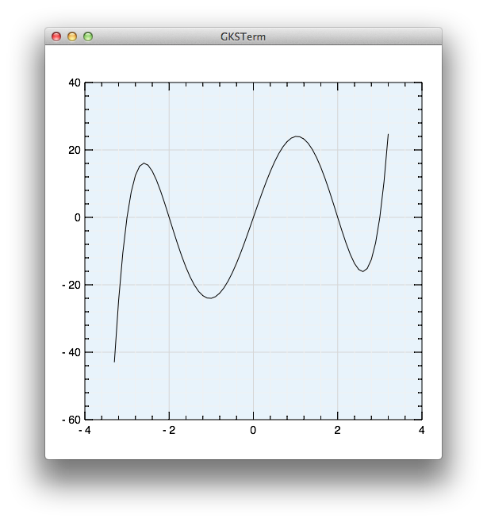

A small plot example
^^^^^^^^^^^^^^^^^^^^
This is s small example that shows how to plot a function with the use of gr:: 

	#!/usr/bin/env python
	# -*- coding: utf-8 -*-

	from gr.pygr import *

	x = [-3.3 + t*0.1 for t in range(66)]
	y = [t**5 - 13*t**3 + 36*t for t in x]
	plot(x, y, bgcolor=163)

*Result:* 

*Explanation:* 
