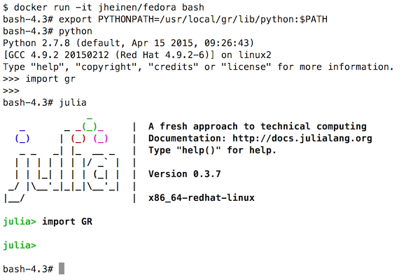

Dockerizing GR
^^^^^^^^^^^^^^

This guide will show you how to create a Fedora docker container for GR
or share the contributed GR container from
`Docker Hub <https://hub.docker.com>`_.

Instead of manually installing GR and required modules it is highly
recommended to use the existing container:

----

To create your "own" full-featured Fedora environment with GR support for
Python and Julia, you have to install some prerequisites first:

.. code-block:: bash

    % docker run -it fedora bash

    $ yum install git make gcc gcc-c++ gcc-gfortran matplotlib ipython \
    texlive-collection-latex PyQt4-devel wxGTK-devel ghostscript-devel \
    glfw-devel zeromq3-devel mupdf-devel jbig2dec-devel openjpeg2-devel \
    libjpeg-turbo-devel julia

Once you have installed the required components, you can install the
GR framework in your newly created container:

.. code-block:: bash

    git clone https://github.com/jheinen/gr
    cd gr
    make install; make clean
    export PYTHONPATH=${PYTHONPATH}:/usr/local/gr/lib/python

You are now ready to use GR from Python.

For the Julia programming language an official ``GR.jl`` package has been
registered. You can add the GR framework to your Julia installation with
the ``Pkg.add()`` function:

.. code-block:: bash

    julia> Pkg.init()
    julia> Pkg.add(“GR”)

At this point, you should be able to use GR::

    julia> using GR

