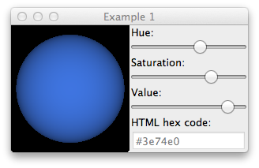

How to use GR3 with wxWidgets
^^^^^^^^^^^^^^^^^^^^^^^^^^^^^

This tutorial will show you how to create a widget fit for drawing on it with
GR3 and it will give you a basic example of an interactive system. As GR3 only
requires an existing (and “current”) OpenGL context, adding GR3 graphics to wx
is rather easy once you get OpenGL running. As OpenGL support seems to be a
rather new addition to wxWidgets, this is the tricky part here. The code was
tested with wxPython version 2.9.4.0 “osx-cocoa (classic)”.

As a start, we use a wx.Frame sub-class with a panel for content and a basic app::

    import wx
 
    class MainFrame(wx.Frame):
        def __init__(self, parent=None, *args, **kwargs):
            super(MainFrame,self).__init__(parent, *args, **kwargs)
 
            self.panel = wx.Panel(self)
 
            self.panel_sizer = wx.BoxSizer(wx.HORIZONTAL)
            self.panel.SetSizerAndFit(self.panel_sizer)
 
            self.sizer = wx.BoxSizer(wx.HORIZONTAL)
            self.sizer.Add(self.panel,1,wx.EXPAND)
            self.SetSizerAndFit(self.sizer)
 
 
    if __name__ == "__main__":
        app = wx.App()
        frame = MainFrame(title="Example 1")
        frame.Show()
        app.MainLoop()
        
To use OpenGL in wxWidgets, we can use the class wx.GLCanvas from the
wx.glcanvas package. The Function GLCanvasWithContext already includes
creation of an OpenGL context. The following example adds such a canvas
widget and binds the paint event. In the paint method, the OpenGL version
will be queried (using PyOpenGL) to see if the context creation was a
success. The minimum size of the canvas is also set to make sure that it
will be visible instead of being reduced to 0x0 pixels by the Fit().
Note the call to SetCurrent(), it is used to make the canvas' OpenGL
context current.

.. code-block:: python

    import wx
    import wx.glcanvas
    from OpenGL.GL import glGetString, GL_VERSION
 
    class MainFrame(wx.Frame):
        def __init__(self, parent=None, *args, **kwargs):
            super(MainFrame,self).__init__(parent, *args, **kwargs)
 
            self.panel = wx.Panel(self)
 
            gl_canvas_attribs = [wx.glcanvas.WX_GL_RGBA,
                                 wx.glcanvas.WX_GL_DOUBLEBUFFER,
                                 wx.glcanvas.WX_GL_DEPTH_SIZE, 16]
            self.gl_canvas = wx.glcanvas.GLCanvasWithContext(self.panel, attribList = gl_canvas_attribs)
            self.gl_canvas.SetMinSize((150,150))
            self.gl_canvas.Bind(wx.EVT_PAINT, self.on_paint_gl_canvas)
 
            self.panel_sizer = wx.BoxSizer(wx.HORIZONTAL)
            self.panel_sizer.Add(self.gl_canvas, 1, wx.EXPAND)
            self.panel.SetSizerAndFit(self.panel_sizer)
 
            self.sizer = wx.BoxSizer(wx.HORIZONTAL)
            self.sizer.Add(self.panel,1,wx.EXPAND)
            self.SetSizerAndFit(self.sizer)
 
        def on_paint_gl_canvas(self,evt):
            self.gl_canvas.SetCurrent()
            print glGetString(GL_VERSION)
 
 
    if __name__ == "__main__":
        app = wx.App()
        frame = MainFrame(title="Example 1")
        frame.Show()
        app.MainLoop()

Since the widget has an OpenGL context now, it is time to add GR3 to it.
That's what's done in the next example. There are several additions:

1. gr3_initialized and init_gr3() – these are used to make sure GR3 is initialized exactly once for this widget.
2. gr3.drawimage() with the canvas' size and the drawable type OpenGL
3. SwapBuffers() to bring the drawn image to the screen (swapping foreground and background buffer)
4. update_scene() – this function is going to contain the scene description and causes the widget to be redrawn after any changes to the scene
5. the EVT_CLOSE handler to make sure GR3 is terminated

.. code-block:: python

    import wx
    import wx.glcanvas
    import gr3
 
    class MainFrame(wx.Frame):
        def __init__(self, parent=None, *args, **kwargs):
            super(MainFrame,self).__init__(parent, *args, **kwargs)
 
            self.Bind(wx.EVT_CLOSE,self.on_close)
            self.panel = wx.Panel(self)
 
            gl_canvas_attribs = [wx.glcanvas.WX_GL_RGBA,
                                 wx.glcanvas.WX_GL_DOUBLEBUFFER,
                                 wx.glcanvas.WX_GL_DEPTH_SIZE, 16]
            self.gl_canvas = wx.glcanvas.GLCanvasWithContext(self.panel, attribList = gl_canvas_attribs)
            self.gl_canvas.SetMinSize((150,150))
            self.gl_canvas.Bind(wx.EVT_PAINT, self.on_paint_gl_canvas)
            self.gr3_initialized = False 
 
            self.panel_sizer = wx.BoxSizer(wx.HORIZONTAL)
            self.panel_sizer.Add(self.gl_canvas, 1, wx.EXPAND)
            self.panel.SetSizerAndFit(self.panel_sizer)
 
            self.sizer = wx.BoxSizer(wx.HORIZONTAL)
            self.sizer.Add(self.panel,1,wx.EXPAND)
            self.SetSizerAndFit(self.sizer)
 
        def on_paint_gl_canvas(self,evt):
            self.gl_canvas.SetCurrent()
            size = self.gl_canvas.GetSize()
            if not self.gr3_initialized:
                self.init_gr3()
            gr3.drawimage(0, size.width, 0, size.height, int(size.width), int(size.height),
                          gr3.GR3_Drawable.GR3_DRAWABLE_OPENGL)
            self.gl_canvas.SwapBuffers()
 
        def init_gr3(self):
            if self.gr3_initialized:
                return
            self.gr3_initialized = True
 
            gr3.init()
            gr3.setcameraprojectionparameters(45, 1, 200)
            gr3.cameralookat(0, 0, -3, 0, 0, 0, 0, 1, 0)
 
            self.update_scene()
 
        def update_scene(self):
            gr3.clear()
            self.Refresh()
 
        def on_close(self, event):
            if self.gr3_initialized:
                gr3.terminate()
            event.Skip()
 
    if __name__ == "__main__":
        app = wx.App()
        frame = MainFrame(title="Example 1")
        frame.Show()
        app.MainLoop()

The last example only shows a black canvas, but everything needed for using
GR3 is ready now. Therefore the next example is an example application for
selecting colors from the HSV system and getting their HTML hex code:

Whenever the user changes the color, the scene is updated and Refresh()
causes a paint event.

.. code-block:: python

    import wx
    import wx.glcanvas
    import gr3
    import colorsys
 
    class MainFrame(wx.Frame):
        def __init__(self, parent=None, *args, **kwargs):
            super(MainFrame,self).__init__(parent, *args, **kwargs)
 
            self.Bind(wx.EVT_CLOSE,self.on_close)
            self.panel = wx.Panel(self)
 
            gl_canvas_attribs = [wx.glcanvas.WX_GL_RGBA,
                                 wx.glcanvas.WX_GL_DOUBLEBUFFER,
                                 wx.glcanvas.WX_GL_DEPTH_SIZE, 16]
            self.gl_canvas = wx.glcanvas.GLCanvasWithContext(self.panel, attribList = gl_canvas_attribs)
            self.gl_canvas.SetMinSize((150,150))
            self.gl_canvas.Bind(wx.EVT_PAINT, self.on_paint_gl_canvas)
            self.gr3_initialized = False
 
            self.color_panel = wx.Panel(self.panel)
            self.hue_slider = wx.Slider(self.color_panel, value = 360, minValue = 0, maxValue = 360)
            self.hue_slider.Bind(wx.EVT_SCROLL, self.on_color_changed)
            self.saturation_slider = wx.Slider(self.color_panel, value = 100, minValue = 0, maxValue = 100)
            self.saturation_slider.Bind(wx.EVT_SCROLL, self.on_color_changed)
            self.value_slider = wx.Slider(self.color_panel, value = 100, minValue = 0, maxValue = 100)
            self.value_slider.Bind(wx.EVT_SCROLL, self.on_color_changed)
            self.html_notation_box = wx.TextCtrl(self.color_panel)
            self.html_notation_box.Disable()
 
            self.color_panel_sizer = wx.BoxSizer(wx.VERTICAL)
            self.color_panel_sizer.Add(wx.StaticText(self.color_panel, label="Hue:"))
            self.color_panel_sizer.Add(self.hue_slider)
            self.color_panel_sizer.Add(wx.StaticText(self.color_panel, label="Saturation:"))
            self.color_panel_sizer.Add(self.saturation_slider)
            self.color_panel_sizer.Add(wx.StaticText(self.color_panel, label="Value:"))
            self.color_panel_sizer.Add(self.value_slider)
            self.color_panel_sizer.Add(wx.StaticText(self.color_panel, label="HTML hex code:"))
            self.color_panel_sizer.Add(self.html_notation_box,0,wx.EXPAND | wx.ALL, 4)
            self.color_panel.SetSizerAndFit(self.color_panel_sizer)
 
            self.panel_sizer = wx.BoxSizer(wx.HORIZONTAL)
            self.panel_sizer.Add(self.gl_canvas, 1, wx.EXPAND)
            self.panel_sizer.Add(self.color_panel)
            self.panel.SetSizerAndFit(self.panel_sizer)
 
            self.sizer = wx.BoxSizer(wx.HORIZONTAL)
            self.sizer.Add(self.panel,1,wx.EXPAND)
            self.SetSizerAndFit(self.sizer)
 
        def on_paint_gl_canvas(self,evt):
            self.gl_canvas.SetCurrent()
            size = self.gl_canvas.GetSize()
            if not self.gr3_initialized:
                self.init_gr3()
            gr3.drawimage(0, size.width, 0, size.height, int(size.width), int(size.height),
                          gr3.GR3_Drawable.GR3_DRAWABLE_OPENGL)
            self.gl_canvas.SwapBuffers()
 
        def init_gr3(self):
            if self.gr3_initialized:
                return
            self.gr3_initialized = True
 
            gr3.init()
            gr3.setcameraprojectionparameters(45, 1, 200)
            gr3.cameralookat(0, 0, -3, 0, 0, 0, 0, 1, 0)
 
            self.on_color_changed(None)
            self.update_scene()
 
        def update_scene(self):
            gr3.clear()
            gr3.drawspheremesh(1,(0,0,0),(self.red,self.green,self.blue),1)
            self.Refresh()
 
        def on_color_changed(self, event):
            hue = self.hue_slider.GetValue()
            saturation = self.saturation_slider.GetValue()
            value = self.value_slider.GetValue()
            self.red, self.green, self.blue = colorsys.hsv_to_rgb(hue/360.0,saturation/100.0, value/100.0)
            html_notation = '#' + hex(256+int(255*self.red))[3:] +
                                  hex(256+int(255*self.green))[3:] +
                                  hex(256+int(255*self.blue))[3:]
            self.html_notation_box.SetValue(html_notation)
            self.update_scene()
 
        def on_close(self, event):
            if self.gr3_initialized:
                gr3.terminate()
            event.Skip()
 
    if __name__ == "__main__":
        app = wx.App()
        frame = MainFrame(title="Example 1")
        frame.Show()
        app.MainLoop()
