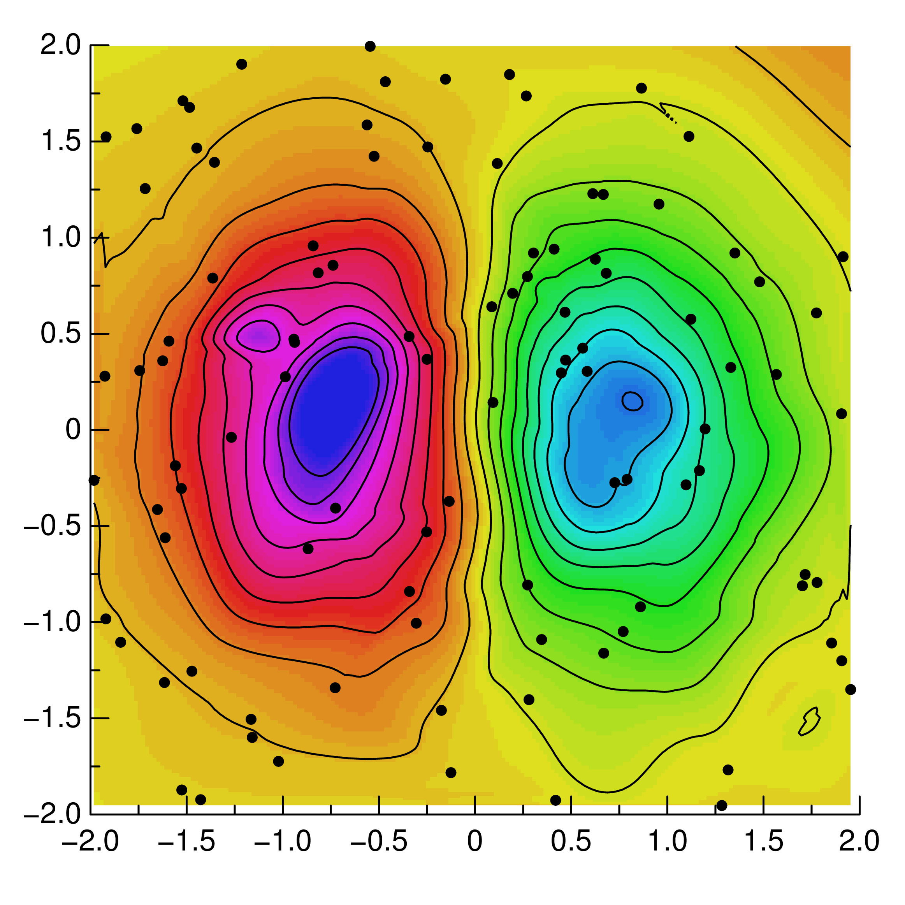

Using the GR framework from other languages
^^^^^^^^^^^^^^^^^^^^^^^^^^^^^^^^^^^^^^^^^^^

*GR* can not only be used from interactive computer programming environments
(like *Python* or *Julia*), but also from traditional languages like *C/C++* or
even *Fortran*.

The following example shows how *GR* can be used in different programming
languages to create a contour plot of unstructured 2-dimensional data.

Let's start with the *Python* version:

.. code-block:: python

    #!/usr/bin/env python
    """
    Create a contour plot of irregular distributed data
    """

    from numpy.random import uniform, seed
    import numpy as np
    import gr

    seed(0)
    xd = uniform(-2, 2, 100)
    yd = uniform(-2, 2, 100)
    zd = xd * np.exp(-xd**2 - yd**2)

    gr.setviewport(0.1, 0.95, 0.1, 0.95)
    gr.setwindow(-2, 2, -2, 2)
    gr.setspace(-0.5, 0.5, 0, 90)
    gr.setmarkersize(1)
    gr.setmarkertype(gr.MARKERTYPE_SOLID_CIRCLE)
    gr.setcharheight(0.024)
    gr.settextalign(2, 0)
    gr.settextfontprec(3, 0)

    x, y, z = gr.gridit(xd, yd, zd, 200, 200)
    h = np.linspace(-0.5, 0.5, 20)
    gr.surface(x, y, z, 5)
    gr.contour(x, y, h, z, 0)
    gr.polymarker(xd, yd)
    gr.axes(0.25, 0.25, -2, -2, 2, 2, 0.01)

    gr.updatews()

The example above should work with Python 2.7, Python 3.4 or PyPy
and will produce the following contour plot:

The next code snippet shows how to generate the same plot in *Julia*:

.. code-block:: julia

    #!/usr/bin/env julia

    import GR

    srand(0)
    xd = -2 + 4 * rand(100)
    yd = -2 + 4 * rand(100)
    zd = [xd[i] * exp(-xd[i]^2 - yd[i]^2) for i = 1:100]

    GR.setviewport(0.1, 0.95, 0.1, 0.95)
    GR.setwindow(-2, 2, -2, 2)
    GR.setspace(-0.5, 0.5, 0, 90)
    GR.setmarkersize(1)
    GR.setmarkertype(GR.MARKERTYPE_SOLID_CIRCLE)
    GR.setcharheight(0.024)
    GR.settextalign(2, 0)
    GR.settextfontprec(3, 0)

    x, y, z = GR.gridit(xd, yd, zd, 200, 200)
    h = linspace(-0.5, 0.5, 20)
    GR.surface(x, y, z, 5)
    GR.contour(x, y, h, z, 0)
    GR.polymarker(xd, yd)
    GR.axes(0.25, 0.25, -2, -2, 2, 2, 0.01)

    GR.updatews()

As you can see, the differences between *Python* and *Julia* are minimal.
The *GR* function signatures are identical.

Calling the *GR framework* from *C/C++* is more complex, but still easy.
The following example should work with any *C* or *C++* compiler:

.. code-block:: c

    //
    //  cc griddata.c -I/usr/local/gr/include -L/usr/local/gr/lib -lGR
    //

    #include <stdlib.h>
    #include <math.h>

    #include "gr.h"
    #include "gks.h"

    int main(void)
    {
      double xd[100], yd[100], zd[100];
      double x[200], y[200], z[200*200];
      double h[20];
      int i;

      srand(0);
      for (i = 0; i < 100; i++)
        {
          xd[i] = -2 + 4.0 * rand() / RAND_MAX;
          yd[i] = -2 + 4.0 * rand() / RAND_MAX;
          zd[i] = xd[i] * exp(-xd[i]*xd[i] - yd[i]*yd[i]);
        }

      gr_setviewport(0.1, 0.95, 0.1, 0.95);
      gr_setwindow(-2, 2, -2, 2);
      gr_setspace(-0.5, 0.5, 0, 90);
      gr_setmarkersize(1);
      gr_setmarkertype(GKS_K_MARKERTYPE_SOLID_CIRCLE);
      gr_setcharheight(0.024);
      gr_settextalign(2, 0);
      gr_settextfontprec(3, 0);

      gr_gridit(100, xd, yd, zd, 200, 200, x, y, z);
      for (i = 0; i < 20; i++)
        h[i] = -0.5 + i / 19.0;
      gr_surface(200, 200, x, y, z, 5);
      gr_contour(200, 200, 20, x, y, h, z, 0);
      gr_polymarker(100, xd, yd);
      gr_axes(0.25, 0.25, -2, -2, 2, 2, 0.01);

      gr_updatews();
    }

Finally, *GR* can be called from *Fortran*, e.g. the *GNU Fortran* compiler.
It's important to use double precision constants for floating point parameters,
otherwise, the results are unpredictable..

.. code-block:: fortran

    C
    C   gfortran griddata.f -L/usr/local/gr/lib -lGR
    C
          program griddata
    C
          integer GKS_K_MARKERTYPE_SOLID_CIRCLE
          parameter (GKS_K_MARKERTYPE_SOLID_CIRCLE = -1)
    C
          double precision xd(100), yd(100), zd(100)
          double precision x(200), y(200), z(200, 200)
          double precision h(20)
          integer i
    C
          call srand(0)
          do 1 i = 1, 100
              xd(i) = -2 + 4 * rand()
              yd(i) = -2 + 4 * rand()
              zd(i) = xd(i) * exp(-xd(i)*xd(i) - yd(i)*yd(i))
      1   continue
    C
          call gr_setviewport(0.1D0, 0.95D0, 0.1D0, 0.95D0)
          call gr_setwindow(-2.0D0, 2.0D0, -2.0D0, 2.0D0)
          call gr_setspace(-0.5D0, 0.5D0, 0, 90)
          call gr_setmarkersize(1.0D0)
          call gr_setmarkertype(GKS_K_MARKERTYPE_SOLID_CIRCLE)
          call gr_setcharheight(0.024D0)
          call gr_settextalign(2, 0)
          call gr_settextfontprec(3, 0)
    C
          call gr_gridit(100, xd, yd, zd, 200, 200, x, y, z)
          do 2 i = 1, 20
            h(i) = -0.5 + i / 19.0
      2   continue
    C
          call gr_surface(200, 200, x, y, z, 5)
          call gr_contour(200, 200, 20, x, y, h, z, 0)
          call gr_polymarker(100, xd, yd)
          call gr_axes(0.25D0, 0.25D0, -2D0, -2D0, 2, 2, 0.01D0)
    C
          call gr_updatews()
          end

One can see that the exact result is reproduced by all of the demos
to some degree - the resulting plots only differ due slight differences
in the underlying random number generators.

